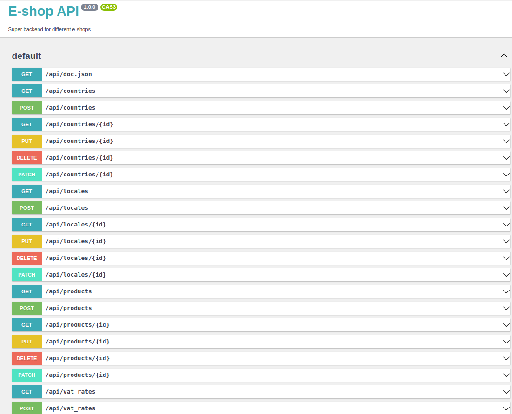

# eshop-api
**Eshop API** allows you to manage prices of products including and excluding VAT rates for different products and countries. It provides endpoints for creating, retrieving, and updating VAT rates, as well as retrieving information about locales, products, and countries.

### Installation
#### To install Eshop API using GitHub, follow these steps:

- Install PostgreSQL and create a database.
- Clone the repository by running the following command:<br>
  ```bash
  git clone https://github.com/ZabFTFT/eshop-api.git
  ```
- Change to the cloned repository directory by running:<br>
    ```bash
  cd eshop-api
  ```
- Install the required packages by running:<br>
    ```bash
   composer install
   ```
- Set the required environment variables in .env file(use .env.sample)
- Build the Docker image by running:<br>
    ```bash
    docker-compose build
  
    docker-compose up
    ```
- Apply the database migrations by running:<br>
    ```bash
    docker exec -it api-web bash
    php bin/console doctrine:migrations:migrate

    **If you want populate db** with initial data:
    php bin/console app:populate-db
    
    exit
   ```
- To get access of API documentation use next endpoint:<br>
    ```bash
   https://localhost:8080/api/doc
   ``` 

### Features
- API documentation at /api/doc
- Management of products,VAT rates, countries and locales
- Retrieve Product VAT information with locale query param
- Creation of Countries with Locales
- Creation of Products
- Creation of Locales
- Creation of VAT rates

### Demo
